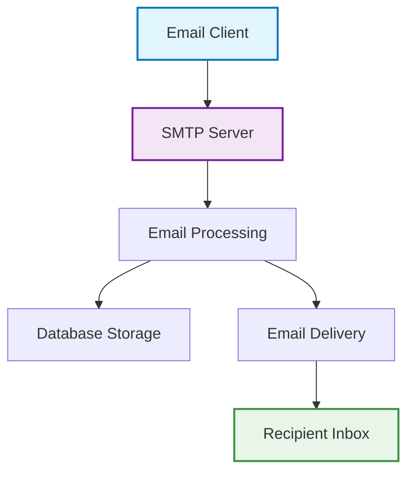
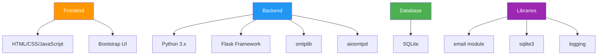
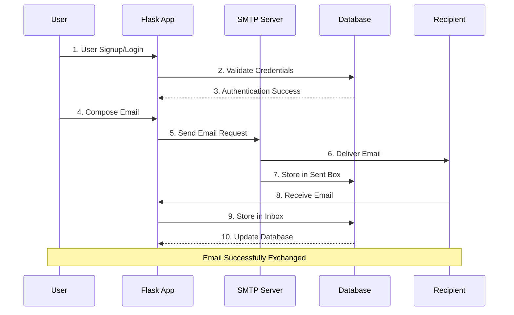
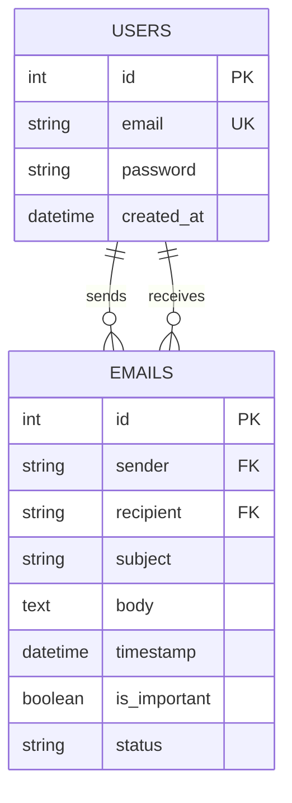
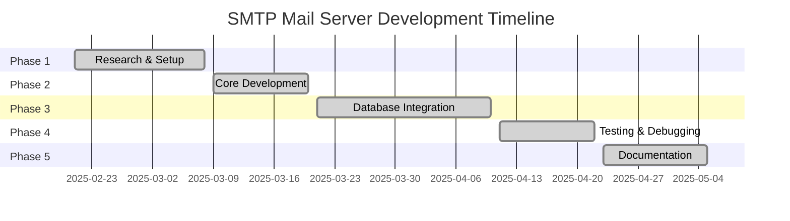
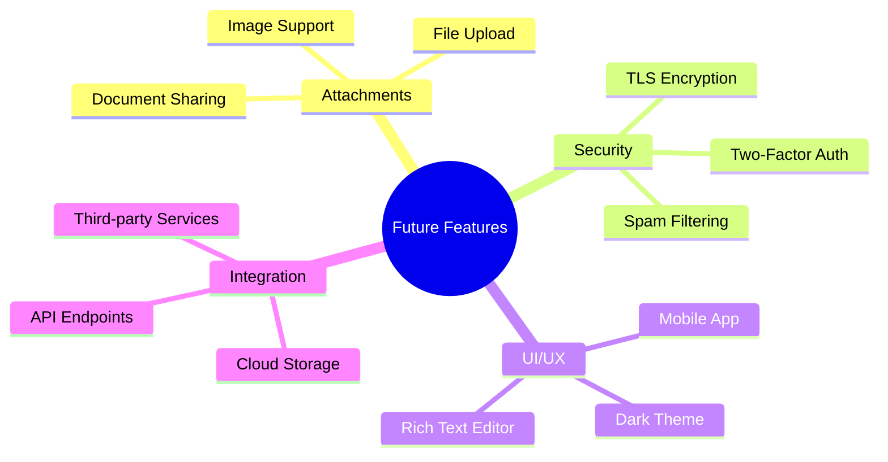

# 📧 SMTP Mail Server Implementation

<div align="center">
  


</div>

## 🌟 About

A comprehensive SMTP (Simple Mail Transfer Protocol) mail server implementation using Python's smtplib and Flask. This project provides a fully functional email communication system with user authentication, email composition, inbox management, and reply functionality. Built with modern web technologies for seamless email handling in controlled environments.

---

## 🎯 Motivation

> **Why Build an SMTP Server?**
> 
> The motivation behind this project is to create an efficient SMTP server that can send and receive emails in a controlled and reliable manner. This enables scalable email communication solutions for various applications requiring simple email transmission.

<div align="center">



*SMTP Server Architecture Overview*
</div>

---

## 🚀 Key Features

<div align="center">

| Feature | Description | Status |
|---------|-------------|--------|
| 📨 **Email Handling** | Process and store incoming emails in SQLite database | ✅ Implemented |
| 🔐 **User Authentication** | Secure login system with duplicate email prevention | ✅ Implemented |
| 📝 **Email Composition** | Rich email composition with subject and body | ✅ Implemented |
| 📬 **Inbox Management** | View received emails with sender details | ✅ Implemented |
| 📤 **Sent Box** | Track all sent emails with timestamps | ✅ Implemented |
| 💬 **Reply Functionality** | Reply to received emails seamlessly | ✅ Implemented |
| ⭐ **Mark Important** | Flag important emails for easy access | ✅ Implemented |
| 🗑️ **Delete Emails** | Remove unwanted emails from inbox/sentbox | ✅ Implemented |
| 📊 **Message Parsing** | Handle multipart messages and extract content | ✅ Implemented |
| 🔍 **Error Handling** | Comprehensive logging and error management | ✅ Implemented |

</div>

---

## 🛠️ Technology Stack

<div align="center">



*Complete Technology Stack*
</div>

### 🔧 Core Technologies

> **🐍 Backend Technologies**
> - **Python 3.x**: Primary programming language
> - **Flask**: Web framework for creating the user interface
> - **smtplib**: Core SMTP functionality for sending emails
> - **aiosmtpd**: Asynchronous SMTP server implementation
> - **SQLite**: Lightweight database for email storage

> **🎨 Frontend Technologies**
> - **HTML5/CSS3**: Structure and styling
> - **Bootstrap**: Responsive UI framework
> - **JavaScript**: Interactive functionality

---

## 🎬 System Workflow

<div align="center">



*Email Communication Flow*
</div>

---

## 🔍 Screenshots & Demo

### 🔐 User Authentication
<div align="center">

**Signup Process**

First Signup Accounts to send mail from one account/Gmail to other.


*Secure user registration with duplicate email prevention*

</div>

### 📧 Email Composition
<div align="center">

**Compose Email Interface**

After logged in, do compose an email on "mudasirnaeem000@gmail.com" Gmail account and sent it to "maisumabbas13@gmail.com"


*Clean and intuitive email composition interface*

</div>

### 🔍 Inbox Management
<div align="center">

**Email Inbox**

Email has successfully been sent to "maisumabbas13@gmail.com" and recieved in inbox folder as well.
Sent messages has also saved in sentbox.


*Organized inbox with sender details and timestamps*

</div>

### 💬 Reply Functionality
<div align="center">

**Email Reply**

We can do a reply as well. Reply emails will sent to the senders mails and sender can review receiver's reply.


*Seamless email reply with thread continuity*

Reply email has been send to sender's mail, and sender also recieved their reply in inbox folder.

</div>

### ⭐ Important Emails
<div align="center">

**Email Mark as Important**

We can delete any email from inbox or sendbox, that may not relevant for us.


We also can mark any email from inbox as important.


*Flag important emails for quick access*


</div>

---

## 🚀 Getting Started

### 📋 Prerequisites

> **System Requirements**
> - Python 3.x installed
> - pip package manager
> - Local machine for testing

### 📦 Required Packages

```txt
Flask==2.3.3
aiosmtpd==1.4.4
sqlite3 (built-in)
smtplib (built-in)
email (built-in)
logging (built-in)
```

---

## 💡 Usage Guide

### 1️⃣ **Account Setup**
- Navigate to signup page
- Create account with unique email
- Login with credentials

### 2️⃣ **Sending Emails**
- Click "Compose" button
- Fill recipient, subject, and message
- Click "Send" to deliver email

### 3️⃣ **Managing Inbox**
- View received emails in inbox
- Mark important emails with star
- Reply to emails directly
- Delete unwanted emails

### 4️⃣ **Tracking Sent Emails**
- Access sent box to view outgoing emails
- Check delivery status
- Manage sent email history

---

## 🔒 Security Features

<div align="center">

| Security Aspect | Implementation | Benefit |
|----------------|----------------|---------|
| 🔐 **User Authentication** | Login/Signup system | Prevents unauthorized access |
| 🚫 **Duplicate Prevention** | Email uniqueness check | Maintains data integrity |
| 📝 **Input Validation** | Form validation | Prevents malicious inputs |
| 🔍 **Error Handling** | Comprehensive logging | Tracks system issues |
| 💾 **Data Storage** | SQLite database | Secure local storage |

</div>

---

## 📊 Database Schema

<div align="center">



*Database Relationship Diagram*
</div>

---

## 🎯 Project Scope & Modules

### 🔍 **Core Modules**

> **📧 Email Processing Module**
> - Handle incoming/outgoing emails
> - Parse email headers and content
> - Store emails in database
> - Manage email threading

> **🔐 Authentication Module**
> - User registration and login
> - Password validation
> - Session management
> - Duplicate email prevention

> **💾 Database Module**
> - SQLite database operations
> - Email storage and retrieval
> - User data management
> - Query optimization

> **🌐 Web Interface Module**
> - Flask-based web application
> - Responsive UI design
> - AJAX operations
> - User-friendly navigation

---

## 📈 Development Timeline

<div align="center">



*7-Week Development Schedule*
</div>

### 📅 **Week-by-Week Breakdown**

| Week | Tasks | Responsibility |
|------|-------|----------------|
| **Week 1-2** | Research & Environment Setup | Both Members |
| **Week 3** | Email Processing & Server Setup | Mudasir |
| **Week 4** | Database Design & Integration | Maisum Abbas |
| **Week 5-6** | Testing & Optimization | Both Members |
| **Week 7** | Documentation & Submission | Both Members |

---

## 🔧 Testing & Quality Assurance

### ✅ **Test Categories**

> **🔍 Functional Testing**
> - Email sending/receiving functionality
> - User authentication workflow
> - Database operations
> - Reply and forward features

> **🛡️ Security Testing**
> - Input validation
> - SQL injection prevention
> - Authentication bypass attempts
> - Data encryption verification

> **⚡ Performance Testing**
> - Email processing speed
> - Database query optimization
> - Memory usage monitoring
> - Concurrent user handling

---

## 🎯 Future Enhancements

<div align="center">



*Planned Future Enhancements*
</div>

---

## 👥 Team Members

<div align="center">

| Name | Roll Number | Responsibilities |
|------|-------------|------------------|
| **Maisum Abbas** | **22K-4129** | Flask Integration & Component Integration  |
| **Mudasir** | **22K-8732** | SMTP Server Implementation & Email Handling |

</div>

---

## 📚 References & Documentation

### 📖 **Official Documentation**
- [Python SMTP Library](https://docs.python.org/3/library/smtplib.html) - Core SMTP functionality
- [Flask Framework](https://flask.palletsprojects.com/) - Web application development
- [SQLite Database](https://docs.python.org/3/library/sqlite3.html) - Database implementation
- [aiosmtpd Library](https://aiosmtpd.aio-libs.org/) - Asynchronous SMTP server

### 🔧 **Technical References**
- [SMTP Protocol Specification](https://tools.ietf.org/html/rfc5321) - RFC 5321
- [Email Message Format](https://tools.ietf.org/html/rfc5322) - RFC 5322
- [TLS for SMTP](https://www.ietf.org/rfc/rfc3207.txt) - Secure transmission
- [Python Email Module](https://docs.python.org/3/library/email.html) - Message composition

### 🎓 **Educational Resources**
- [Postfix Configuration](https://www.postfix.org/) - Mail server setup
- [Email Authentication](https://dmarc.org/) - Security standards
- [OpenSSL Documentation](https://www.openssl.org/) - Encryption implementation

---

## 🔧 System Requirements

### 💻 **Hardware Requirements**
- **Network**: Internet connection for testing

### 🖥️ **Software Requirements**
- **Operating System**: Windows 10/11, macOS, or Linux
- **Python**: Version 3.7 or higher
- **Browser**: Chrome, Firefox, Safari, or Edge
- **IDE**: PyCharm, VS Code, or any text editor

---

## 📞 Contact & Support

<div align="center">

**Need Help? Let's Connect!** 🌟

[](https://linkedin.com/in/mudasir-naeem-698679303)
[](https://github.com/MudasirNaeem1/SMTP-Server-Python-smtplib-flask)
[](mailto:mudasirnaeem000@gmail.com)

---

### 💬 **Get In Touch**

📧 **Email Support**: mudasirnaeem000@gmail.com  
🎓 **Institution**: National University of Computer & Emerging Sciences  
📍 **Location**: Karachi, Pakistan  

**Found this project helpful?** ⭐ **Star the repository!**  
**Have suggestions?** 💭 **Feel free to discuss!**  
**Want to collaborate?** **Let's connect!**


</div>

---

<div align="center">

** Thank you for exploring our SMTP Mail Server project! **


</div>
